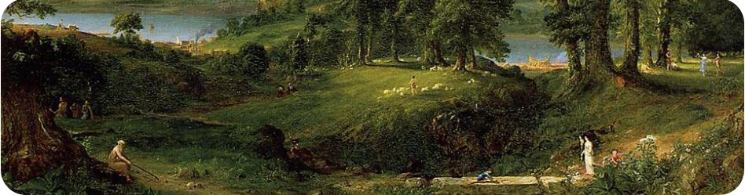

## Code-Barre 🤖

### About me 🕴

**I'm Code-Barre**, a 🇫🇷 french 🇫🇷 fullstack developper, cybersecurity enthusiat and a student.

I'm interested in development, devops and I've found myself a recent keen in cybersecurity.

Also I love❤ classical art and music.

You can see more by going to my [website](https://codebarru.fr/).

### My Skills 🔥

#### Low level languages

#### High level languages & frameworks

#### Deployment

### Stats 📈

### How to reach me ✉

If you want to ask me anything, you can write me at codebarru@protonmail.com.
